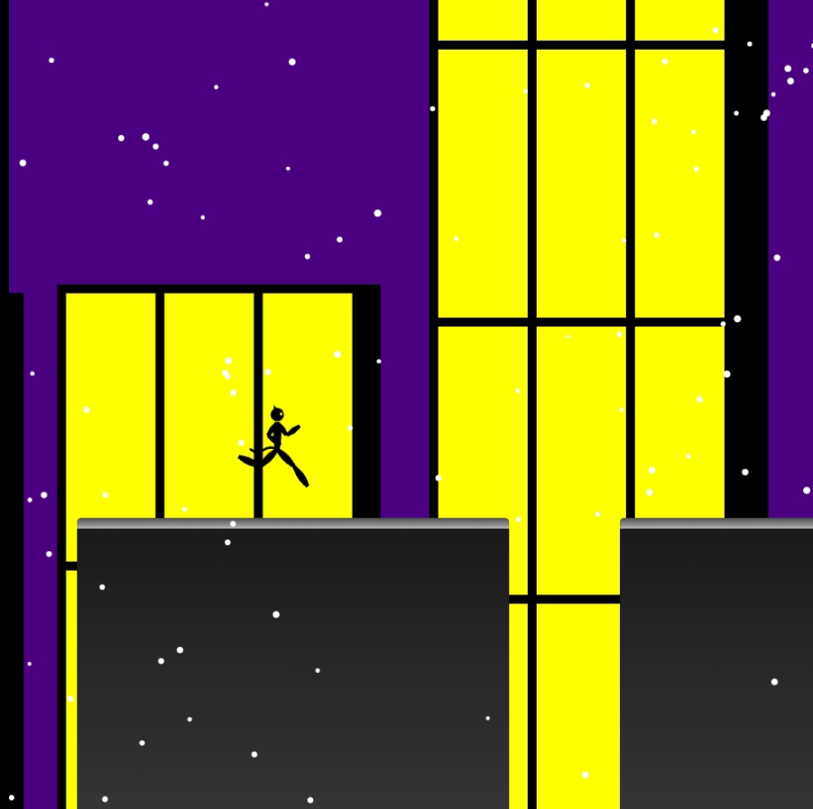

<h1><a href="//bacionejs.github.io/cat/index.html" style="text-decoration: none; color: inherit;">Play</a></h1>

 
 

**Inter-Galactic Gazette** comments:

- "I can't believe I've played this lovely little zen game the whole trip to Alpha Centauri. It definitely helped me reconnect with my hometown of New York in a nostalgic way."
- "Perfect for when I'm feeling cool, detached, and unreliable...meow"
- "No missions, no levels, no chaos. Just me and the city skyline."
- "Calms the femme fatale catwoman part of me."
- "This game brought out the melancholy side of me, especially the snow."
- "Forget jumping every time the captain comes on deck—jumping is optional in this game."
- "Tired of fighting? Nothing to shoot here and no scores to settle."
- "Not a substitute for the holodeck, but I'd play it again."
- "Tired of clawing your way to the top? There's no claws in this cat's paw. Just a lot of guts."
- "The in-game music is okay, but I prefer to mute it by clicking in the upper right corner of the game and then playing some [Smooth Trumpet Jazz – Spotify](https://open.spotify.com/playlist/6gqJPa4A4gXTwTSGWcpC1d)

## Credits
- Music Player: [pl_synth](https://github.com/phoboslab/pl_synth)
- Song: Ambidumbi by Gargaj

